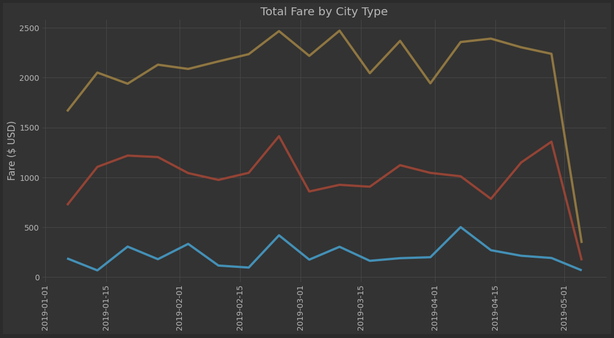
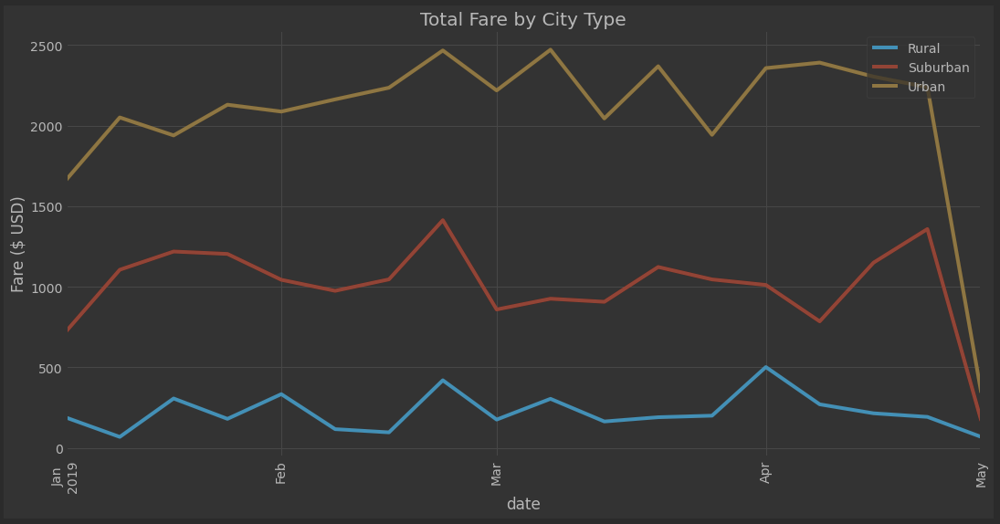
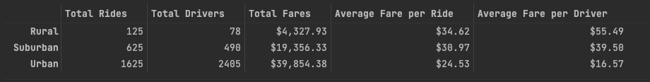

# Overview of analysis
We have examined the cost of fares of different population types.  How to costs compare?  

We have gathered fares across multiple cities, the number of drivers and charted that data over time to see what pattern 
emerges.

## Results

We saw a pretty clear segmentation of costs by population center.  Urban areas saw higher fares than Suburban areas.  
Suburban areas had higher fares that Rural areas.  Curiously, all areas saw a relative increase in fares in late February.

As a natural result of a lower total number of fares, Rural areas saw a much higher average fare per driver and average fare per ride. But the highest 
total fare generators were in Urban areas.

## Summary
With the key metric of cost per driver in mind, servicing Rural communities is still a key moneymaker given the highest
Fare per ride / driver. Yet we can not overlook the urban and suburban markets at strong coverage means capturing the 
store demand for ride shares.